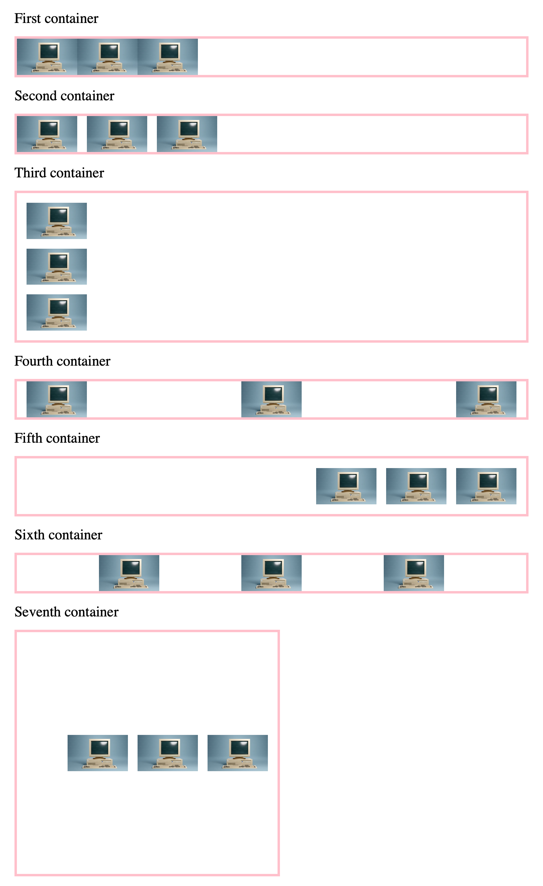

# Review 3

Make a new repository `review-3` (public) where you can upload your work.

Please use an **external stylesheet** to style your page.

Recreate the following website:

### Points

- One point for getting the external stylesheet right
- One point for getting all the captions ('First container', ...) right
- One point **per container** if you get the flex, the margin, the padding, etc. right

### Notes

- All containers have `display: flex`
- The image should be `100px` wide
- The URL for the photo is `https://plus.unsplash.com/premium_photo-1714618937022-97adf8e67cb6?w=900&auto=format&fit=crop&q=60`
- When there are gaps, margins, etc., they are always `16px`
- The border is `4px` wide and `pink`
- All headlines are `24px`
- The seventh container is `400px` wide and tall
